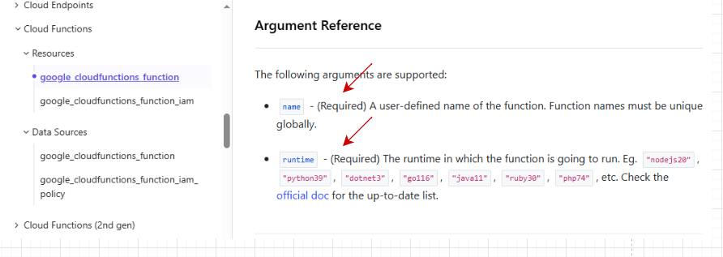
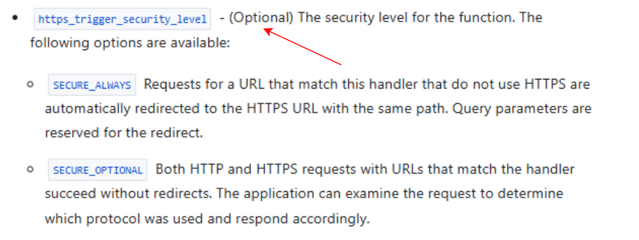

<a id="top"></a>
<h1 align="center">What goes into your compliant.tf and nonCompliant.tf</h1>

# compliant.tf

Your `compliant.tf` contains the example that makes your policy **pass**.  
It must include all the required arguments and set the attribute you are writing the policy on to a compliant value.

### 1. Replace `RESOURCE_TYPE` with your resource from Terraform

```hcl
resource "RESOURCE_TYPE" "compliant_example_1" {

}
```

### 2. Input compliant values for the required arguments

Use the Terraform documentation to identify all **required arguments** and provide valid (compliant) values.



### For example:

```hcl
resource "google_cloudfunctions_function" "compliant_example_1" {
  name    = "compliant_example_1"
  runtime = "Python3.12"
  region  = "google_cloudfunctions_function.function.region"
  project = "google_cloudfunctions_function.function.project"
}
```

### 3. Input a compliant value for the argument you are writing your policy on

From your research on your service's arguments, you should know what to input so the policy is compliant.

### Example: `https_trigger_security_level`



```hcl
resource "google_cloudfunctions_function" "compliant_example_1" {
  name                         = "compliant_example_1"
  runtime                      = "Python3.12"
  region                       = "google_cloudfunctions_function.function.region"
  project                      = "google_cloudfunctions_function.function.project"
  https_trigger_security_level = "SECURE_ALWAYS"
}
```

# nonCompliant.tf

Your `nonCompliant.tf` contains the example that makes your policy **fail**. Like `compliant.tf`, it must include all required Terraform arguments, but the value related to the policy should violate the compliance rule.

### For Example

Service: `Cloud Functions`  
Resource type: `google_cloudfunctions_function`

```hcl
resource "google_cloudfunctions_function" "non_compliant_example_1" {
  name                         = "non_compliant_example_1"
  runtime                      = "Python3.12"
  region                       = "google_cloudfunctions_function.function.region"
  project                      = "google_cloudfunctions_function.function.project"
  https_trigger_security_level = "SECURE_OPTIONAL"
}
```

> **Fixture labels matter:** the linter requires both the resource label **and** the `name`
> argument to follow `compliant_example_N` / `non_compliant_example_N` (numbered from 1). Add
> further numbered blocks (`compliant_example_2`, …) if you need more than one example.

<div align="center"> 

[⬅️ Previous: Policy writing](policy-writing.md#top) &nbsp;&nbsp;&nbsp; | &nbsp;&nbsp;&nbsp; 
[📘 Back to Contents](policy-writing-tutorial.md#top) &nbsp;&nbsp;&nbsp; | &nbsp;&nbsp;&nbsp; 
[Next: Terraform inputs ➡️](terraform-inputs.md#top) 

</div>
