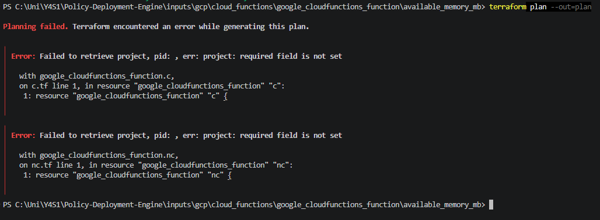
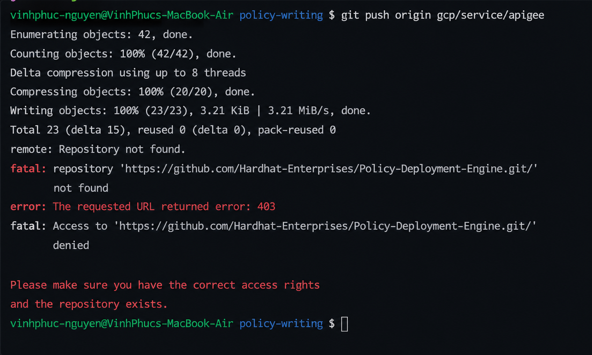

<a id="top"></a>
<h1 align="center">Common Errors</h1>

## Missing required Terraform attributes



The error indicates that required Terraform arguments such as `project` or `region` are missing from the `compliant.tf` or `nonCompliant.tf` files.

### Fix

Include all required attributes for the resource.

```hcl
resource "google_cloudfunctions_function" "compliant_example_1" {
  name                = "compliant_example_1"
  runtime             = "Python3.12"
  region              = "google_cloudfunctions_function.function.region"
  project             = "google_cloudfunctions_function.function.project"
  available_memory_mb = 128
}
```

---

### 403 Error


Your GitHub account does not have write access to the repository.

### Fix

Request repository access from a maintainer or supervisor and ensure your GitHub account has been added to the Policy Deployment Engine repository.

---

## Terraform Plan Conflict — multiple credentials in one block

When writing a policy for a resource that has multiple credential types (for example: `auth_token`, `password`, `service_key`), placing all of them in a single block will cause a Terraform plan error. This is because Terraform only allows one credential type to be set at a time in that block.

### Fix

Split each credential into its own attribute. Each attribute gets its own **inputs** folder
(`compliant.tf`, `nonCompliant.tf`, `config.tf`) and its own flat `<attribute>.rego` in the
resource's **policies** folder:

```
inputs/gcp/<Service>/google_monitoring_notification_channel/
  auth_token/
    compliant.tf
    nonCompliant.tf
    config.tf
  password/
    compliant.tf
    nonCompliant.tf
    config.tf
  service_key/
    compliant.tf
    nonCompliant.tf
    config.tf

policies/gcp/<Service>/google_monitoring_notification_channel/
  _vars.rego
  auth_token.rego
  password.rego
  service_key.rego
```

---

## nonCompliant.tf not producing the expected OPA result

If your OPA test is passing when it should be failing (or vice versa), check that your
`nonCompliant.tf` is setting **all** the relevant attributes to their non-compliant values —
not just one.

For example, when writing a policy for `validate_ssl` on an HTTPS uptime check, setting only `validate_ssl = false` is not enough. You also need to set `use_ssl = false`, otherwise the plan may not reflect the non-compliant state correctly.

### Fix

Make sure all related attributes are set consistently in `nonCompliant.tf`:

```hcl
resource "google_monitoring_uptime_check_config" "non_compliant_example_1" {
  display_name = "non_compliant_example_1"
  timeout      = "60s"

  http_check {
    path         = "/"
    use_ssl      = false
    validate_ssl = false
  }

  monitored_resource {
    type = "uptime_url"
    labels = {
      project_id = "my-project"
      host       = "example.com"
    }
  }
}
```

---

<div align="center">

[📘 Back to Contents](policy-writing-tutorial.md#top) &nbsp;&nbsp;&nbsp;  &nbsp;&nbsp;&nbsp;

</div>
