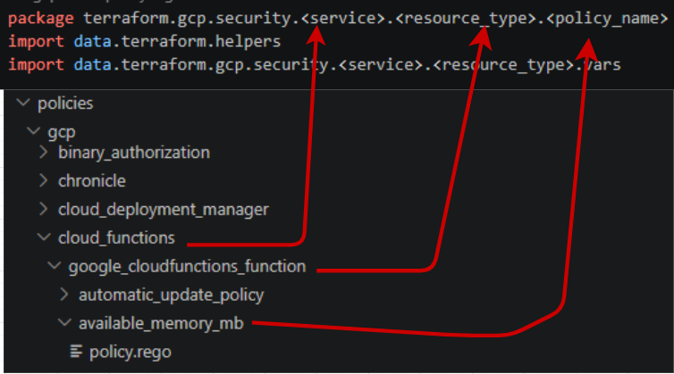
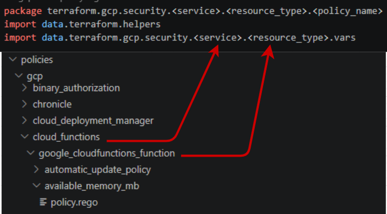
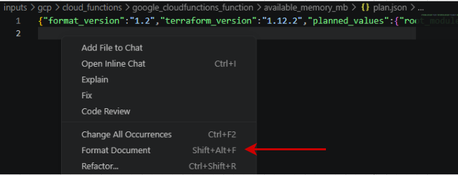
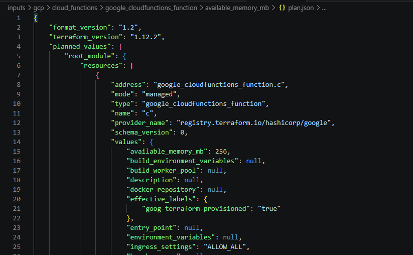

<a id="top"></a>
<h1 align="center">policy.rego</h1>

> Your policy file is named after the attribute it checks — `<attribute>.rego` — and lives
> **flat** in the resource folder `policies/gcp/<Service>/<resource type>/` (there is no
> per-attribute subfolder).

### Rego package naming convention from directory structure

The package name in your `<attribute>.rego` file must follow the directory structure of your policy.








### Example

```rego
package terraform.gcp.security.cloud_functions.google_cloudfunctions_function.available_memory_mb 
import data.terraform.helpers
import data.terraform.gcp.security.cloud_functions.google_cloudfunctions_function.vars
```
## Attribute Paths
Attribute paths are used to locate specific values inside the Terraform `plan.json` file.
They map directly to the structure of the JSON and are used to extract values from a resource.

Your attribute paths come from the `json` plan you created using the following commands:

`terraform plan --out=plan`  
`terraform show -json plan > plan.json`

### Format Document 

Make sure to format the document so it becomes readable



Transforms it into this




### How to determine your attribute path

1. Navigate to:

`planned_values → root_module → resources → values`

2. Find the attribute you want to check.

3. Convert it into an attribute path:

- If the value is **directly inside `values`**, use:
  
      ["attribute_name"]

- If the value is **nested inside objects or arrays**, include each level.

### Example (Simple Attribute)

From the JSON:

    "values": {
      "available_memory_mb": 256
    }

The attribute path is:

    ["available_memory_mb"]


### Example (Nested Attribute)

If the structure was:

    "values": {
      "rsa": [
        {
          "key": 2048
        }
      ]
    }

The attribute path would be:

    ["rsa", 0, "key"]


### Different ways to write your policy

The engine dispatches on `policy_type`, using these supported values:

| `policy_type` | Use it when |
|---|---|
| `blacklist` | The attribute must not be one of these values |
| `whitelist` | The attribute must be one of these values (arrays: **every** element must be) |
| `range` | A number must be above / below / between bounds |
| `pattern blacklist` | A wildcard-extracted part of the value must not be one of these |
| `pattern whitelist` | A wildcard-extracted part of the value must be one of these |
| `element blacklist` | No element of an array may **contain** one of these substrings |
| `element pattern whitelist` | Every element of an array must match one of the wildcard shapes |
| `map key blacklist` | No map key may match a prohibited name, ignoring capitalisation, with a non-empty value |

Write them **lowercase, with a space** — `pattern whitelist`, never `pattern_whitelist`. Anything
else is not a policy type: the engine cannot dispatch it, so it stops and reports
`POLICY ERROR: unknown policy_type ...` and your test goes red. `policy_lint`'s
[`unknown-policy-type`](policy-lint.md#unknown-policy-type) rule catches it before you get that far.

There is no *exact-match* `element whitelist`, and you do not need one — plain `whitelist`
already covers that (see the Whitelist note below). For *pattern*-based list whitelisting,
use `element pattern whitelist`.

---

### Whitelist

Whitelist allows only specific values and blocks everything else.

> **Whitelist already handles lists.** When the attribute is an array, the helper requires
> *every* element to be in your `values` set (it is a subset test), so
> `"attribute_path": ["allowed_ips"]` under a `whitelist` is a complete check — you do not need,
> and will not find, an *exact-match* `element whitelist`. `element blacklist` exists as a separate
> type only because *forbidding* a list needs substring matching, which the plain `blacklist` does
> not do. For *pattern*-based list validation (every element must match a shape), use
> `element pattern whitelist`.

```rego

    [
      {
        "situation_description": "Resource is not using Linux",
        "remedies": ["Change the OS to linux"]
      },
      {
        "condition": "Test if an OS is not Linux",
        "attribute_path": ["parent"],
        "values": ["Linux"],
        "policy_type": "whitelist"
      }
    ]
```


### Blacklist

Blacklist disallows specific values.
```rego
    [
      {
        "situation_description": "Resource is using Linux",
        "remedies": ["Change the OS from linux"]
      },
      {
        "condition": "Test if an OS is Linux",
        "attribute_path": ["parent"],
        "values": ["Linux"],
        "policy_type": "blacklist"
      }
    ]
```
---

### Range

Range is used with numeric values to enforce minimum, maximum, or bounded ranges.


### Minimum

Ensures a value is above a minimum threshold.
```rego
    [
      {
        "situation_description": "Check if key is over 1000 bits",
        "remedies": ["Enforce a key over 1000 bits"]
      },
      {
        "condition": "Test if key size is over 1000 bits",
        "attribute_path": ["rsa", 0, "key"],
        "values": [1000, null],
        "policy_type": "range"
      }
    ]
```


### Maximum

Ensures a value is below a maximum threshold.
```rego
    [
      {
        "situation_description": "Check if key is under 1000 bits",
        "remedies": ["Enforce a key under 1000 bits"]
      },
      {
        "condition": "Test if key size is under 1000 bits",
        "attribute_path": ["rsa", 0, "key"],
        "values": [null, 1000],
        "policy_type": "range"
      }
    ]
```


### Range (Bounded)

Ensures a value falls within a specific range.
```rego
    [
      {
        "situation_description": "Check if key is between 1000 and 2000 bits",
        "remedies": ["Ensure key is 1000 to 2000 bits"]
      },
      {
        "condition": "Test if key size is within 1000 to 2000 bits",
        "attribute_path": ["rsa", 0, "key"],
        "values": [1000, 2000],
        "policy_type": "range"
      }
    ]
```


### Pattern Whitelist

Allows only values that match a defined pattern. `values` is **two** entries: a target string
whose `*` wildcards mark the parts you care about, then a list of allowed values *per wildcard
position* (first list for the first `*`, and so on). It is a wildcard match, not a regex.

> **Both entries are required, and a lone regex silently disables the condition.** Writing
> `"values": ["^projects/[^/]+/.../cryptoKeys/[^/]+$"]` is the most common mistake on this type.
> With only one entry there is no per-position list to compare against, so the condition
> **flags nothing at all** — unset, empty, malformed and correct values pass it equally. Nothing
> in your test run says so either: the kit still goes green, because a sibling condition is what
> catches your nonCompliant fixture. `policy_lint`'s
> [`pattern-values-shape`](policy-lint.md#pattern-values-shape) rule catches this. If what you
> want is "the value must have this shape", that is **`element pattern whitelist`** (below) —
> it takes a flat list of wildcard shapes and works on a plain string too.
>
> Giving *fewer* lists than there are `*`s is fine and deliberate: `["*://*", [["https"]]]`
> constrains the scheme and leaves the host unchecked. The lists are matched to the `*`s in
> order, and any position without a list is simply not checked.

> **A value that does not match the target is never flagged.** The helper extracts the wildcard
> parts out of the value first; if the value does not fit the target shape at all, there is
> nothing to extract and the resource passes. So `"project/*/gcp/*"` says "*if* it looks like
> this, the parts must be allowed" — it does **not** say "it must look like this". If the shape
> itself is the control, check the shape with an `element pattern whitelist` (or a `whitelist`,
> or a `pattern blacklist` on the bad shape) as a second condition.

> **Neither pattern type flags a missing value.** An argument that is absent has nothing to
> extract from, so it passes. Pair the pattern with a `blacklist` on `[null, ""]` when "it must
> be set" is part of the control — and list `null`, not just `""`: an argument left out of the
> Terraform reaches the engine as `null`. See
> [`presence-missing-null`](policy-lint.md#presence-missing-null).
```rego
    [
      {
        "situation_description": "Check description fits a defined pattern",
        "remedies": ["Fix description to fit pattern"]
      },
      {
        "condition": "Wrong description pattern",
        "attribute_path": ["description"],
        "values": ["project/*/gcp/*", [["a","c","d"],["b","d"]]],
        "policy_type": "pattern whitelist"
      }
    ]
```


### Pattern Blacklist

Blocks values that match a defined pattern.
```rego
    [
      {
        "situation_description": "Check description fits a defined pattern",
        "remedies": ["Fix description to fit pattern"]
      },
      {
        "condition": "Wrong description pattern",
        "attribute_path": ["description"],
        "values": ["project/*", [["root"]]],
        "policy_type": "pattern blacklist"
      }
    ]
```


### Element Blacklist

Blocks **array** attributes whose elements contain any blacklisted **substring** (simple
`contains` matching, not regex). `values` is a flat array of forbidden substrings.

> **It matches substrings, so it catches more than the exact value.** Blacklisting `"*"` also
> flags `"https://example.com/*"` and `"*.googleapis.com"`, because both *contain* a `*`. That
> is usually what you want for a wildcard check — but it means a short substring like `"dev"`
> will also flag `"developer-portal"`. Pick substrings that cannot appear innocently, or anchor
> them with a separator (`"dev-"`, `"-sandbox"`).
```rego
    [
      {
        "situation_description": "Resource names must only include authorized projects",
        "remedies": ["Remove unauthorized or non-production projects"]
      },
      {
        "condition": "Resource names contain a blacklisted substring",
        "attribute_path": ["resource_names"],
        "values": ["attacker-project", "test-project", "dev-", "-sandbox"],
        "policy_type": "element blacklist"
      }
    ]
```

### Map Key Blacklist

Checks the **names inside a map**, rather than list elements or the map's values.
`values` is a flat list of prohibited names. Matching ignores capitalisation but
requires the whole name: `Authorization` matches `AUTHORIZATION`, not
`X-Authorization-Mode`.

A matching key is flagged only when its value is neither `null` nor an empty
string. Whitespace-only values are still non-empty. Missing/null maps and empty
objects are allowed. Through `get_multi_summary`, a present non-map value causes
`POLICY ERROR:` rather than a passing result. For example, omitting the `0` from
the path below makes the shared extractor return an array of maps, not one map.
Check the path and include the list indexes. Paths resolving to missing/null are
still treated as absent optional maps. This checks known values in root-module
resources, like the other helpers.

```rego
    [
      {
        "situation_description": "The webhook contains sensitive inline request headers",
        "remedies": ["Move credentials to secret_versions_for_request_headers."]
      },
      {
        "condition": "Reject sensitive header names with non-empty inline values",
        "attribute_path": ["generic_web_service", 0, "request_headers"],
        "values": ["authorization", "proxy-authorization", "api-key", "x-api-key", "x-auth-token"],
        "policy_type": "map key blacklist"
      }
    ]
```

For the Service Directory webhook, use
`["service_directory", 0, "generic_web_service", 0, "request_headers"]` instead.
Violation messages name the matching keys without printing their values.
See the [helper documentation](../../policies/_helpers/README.md#7-map-key-blacklist)
for a complete conditions example and the test command.

### Element Pattern Whitelist

Allows only **array** attributes whose **every** element matches one of the required
wildcard shapes. `values` is a list of shape strings; an element passes if it matches
any one of them. Each `*` matches one path segment (one or more non-`/` characters), so
a `*` never spans a separator. A string attribute is checked as a one-item list. An
empty `values` list matches nothing, so it flags every element (a loud failure). This
is the positive (allowlist) counterpart to `element blacklist` for lists of resource
paths.
```rego
    [
      {
        "situation_description": "Guardrails must be explicit platform resource paths",
        "remedies": ["Reference a concrete guardrail resource path"]
      },
      {
        "condition": "Guardrails must match the platform path shape",
        "attribute_path": ["guardrails"],
        "values": ["projects/*/locations/*/apps/*/guardrails/*"],
        "policy_type": "element pattern whitelist"
      }
    ]
```

<div align="center">

[⬅️ Previous: _vars.rego](vars-rego.md#top) &nbsp;&nbsp;&nbsp; | &nbsp;&nbsp;&nbsp;
[📘 Back to Contents](policy-writing-tutorial.md#top) &nbsp;&nbsp;&nbsp; | &nbsp;&nbsp;&nbsp;
[Next: Testing your policies ➡️](testing-policies.md#top) 

</div>
