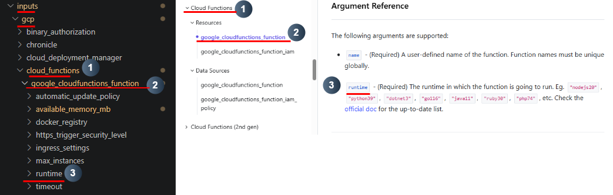
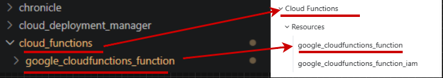
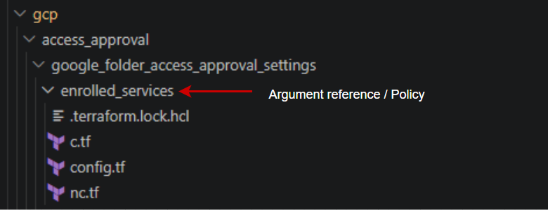

<h1 align="center">Policy Writing</h1>

## Folder Structure

Set up the correct folder structure for your service. Everything lives under
`policies/gcp`: each resource type has its own folder, and each attribute gets its own
subfolder inside it holding the policy **and** its fixtures together.

### 1. Create a folder for your service and resource type

Navigate to `policies/gcp` and create a folder for your service.

Inside this folder, create a new folder for your resource type based on Terraform.

### 2. Add the attribute (policy)

When you have determined that an argument reference has security relevance, create one
folder for it:

  `policies/gcp/<Service>/<resource type>/<attribute>/`

It holds three files — `policy.rego`, `compliant.tf` and `nonCompliant.tf`.

### Example: `runtime`

### Naming Convention

- **Service folders** mirror the docs taxonomy — use the existing `docs/gcp/<Service>` folder
  name verbatim (these may contain spaces/parentheses, e.g. `Cloud Functions`, `Cloud Run (v2 API)`).
- **Resource type folders** and **attribute names** must match the Terraform names **exactly**
  (lowercase with underscores, e.g. `google_cloudfunctions_function`, `available_memory_mb`).
- The lowercase underscore **service slug** (e.g. `cloud_functions`) is only used inside the
  Rego package name — not the folder name.

### Example: `cloud_functions`

#### Resource folders

## What files do you need in your folders?

### 1. Copy required files

Copy from `templates/gcp` into your attribute folder
`policies/gcp/<Service>/<resource type>/<attribute>/`:
- `compliant.tf`
- `nonCompliant.tf`
- `policy.rego`

There is no `config.tf` to copy — one shared provider stub lives at
`policies/gcp/config.tf` and the test harness supplies it automatically.

Then copy **one** `_vars.rego` into the resource folder
`policies/gcp/<Service>/<resource type>/` (one per resource, shared by all of its
policies) — it sits beside the attribute folders, not inside them.

### For example

  
  

<em>Inputs/gcp(left) and policies/gcp(right)</em>
 

[⬅️ Previous: Researching and Documentation](researching-and-documentation.md#top) &nbsp;&nbsp;&nbsp; | &nbsp;&nbsp;&nbsp;
[📘 Back to Contents](policy-writing-tutorial.md#top) &nbsp;&nbsp;&nbsp; | &nbsp;&nbsp;&nbsp;
[Next: compliant.tf & nonCompliant.tf ➡️](c-tf-and-nc-tf.md#top)

