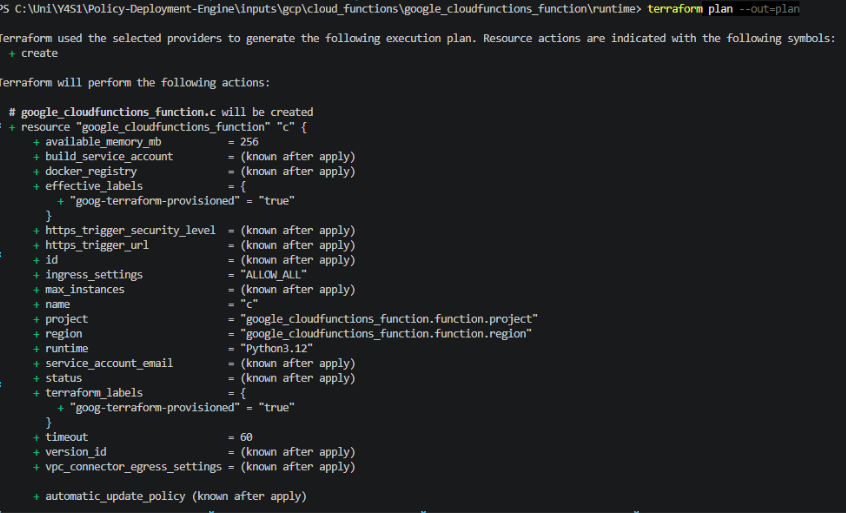
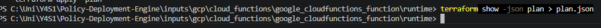

<h1 align="center">Terraform inputs</h1>

> You generate a plan here mainly to **inspect it and find your attribute path**. You do
> **not** commit `plan.json` — when you run the test harness (`auto_test.py`), it produces and
> caches the plan for you under `inputs/plan_cache/`.

### 1. terraform init

Make sure you are in the inputs directory of the attribute you are writing your policy on:

`inputs/gcp/<Service>/<resource>/<attribute>/`

    terraform init

### 2. get binary plan

    terraform plan --out=plan

### 3. turn plan into .json file

    terraform show -json plan > plan.json

if you are having trouble with this section please visit [Common Errors](common-errors.md)

[⬅️ Previous: compliant.tf and nonCompliant.tf](c-tf-and-nc-tf.md#top) &nbsp;&nbsp;&nbsp; | &nbsp;&nbsp;&nbsp;
[📘 Back to Contents](policy-writing-tutorial.md#top) &nbsp;&nbsp;&nbsp; | &nbsp;&nbsp;&nbsp;
[Next: _vars.rego ➡️](vars-rego.md#top) 

