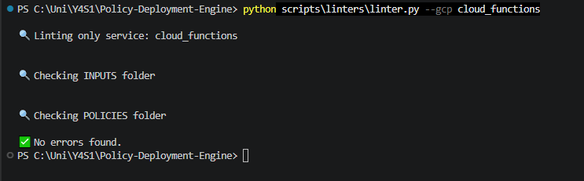

<h1 align="center">Testing your policies</h1>

### 1. Run the linter

The linter validates that the `docs/` and `policies/` trees reconcile and that your
fixtures are well-formed. It runs automatically on commit via pre-commit, or you can run it directly:

    python3 scripts/linters/linter.py --platform gcp

### 2. Run the OPA test harness

`auto_test.py` runs the full `terraform plan` → `opa eval` flow for you: it plans each fixture
(using a committed plan cache and an offline provider cache), then evaluates your policy against
the compliant and non-compliant fixtures.

    # One resource (recommended while you work):
    python3 scripts/auto_test/auto_test.py "gcp/<Service>/<resource>"

    # The whole service:
    python3 scripts/auto_test/auto_test.py "gcp/<Service>"

    # The whole platform:
    python3 scripts/auto_test/auto_test.py gcp

A passing run means the compliant fixture produces no violation and the non-compliant fixture
does. Fix any failures and re-run until the resource is green.

> The first run builds an offline provider cache under `.terraform-cache/` (one-time per
> machine, a few minutes). See the repo `README.md` → **Testing Your Policies Locally** for
> the full details, prerequisites, and the plan-cache workflow.

if you are having trouble with this section please return to [Common Errors](common-errors.md)

[⬅️ Previous: policy.rego](policy-rego.md#top) &nbsp;&nbsp;&nbsp; | &nbsp;&nbsp;&nbsp;
[📘 Back to Contents](policy-writing-tutorial.md#top) &nbsp;&nbsp;&nbsp; | &nbsp;&nbsp;&nbsp;
[Next: policy_lint — content-quality rules ➡️](policy-lint.md#top) 

